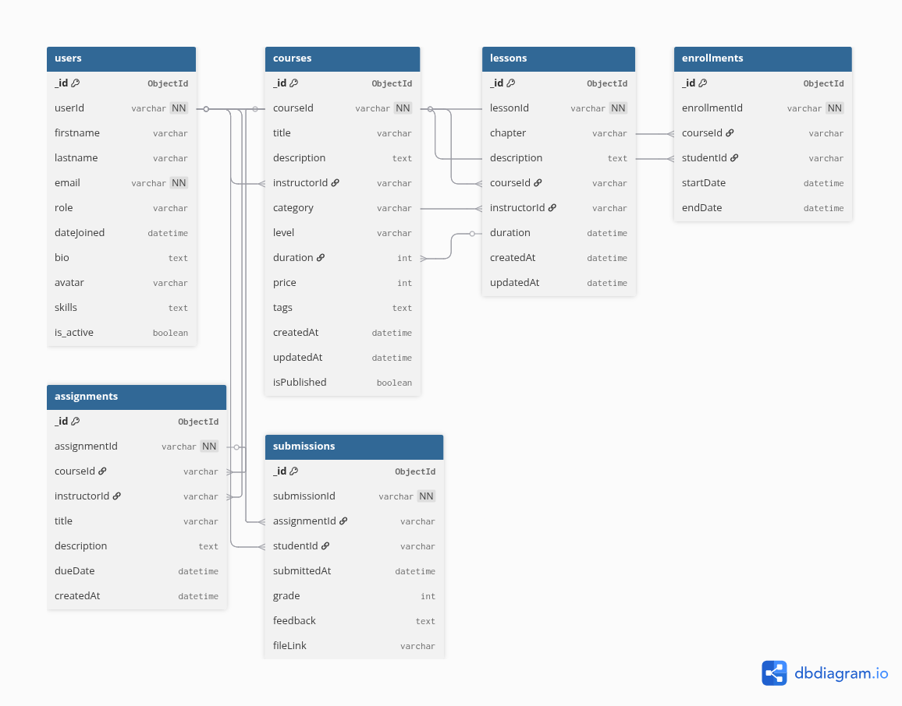

# 📚 EduHub MongoDB LMS

EduHub is a **MongoDB-based Learning Management System (LMS)** built to simulate a real-world educational platform. It manages **users, courses, enrollments, assignments, analytics, and recommendations**, providing insights into student engagement and instructor performance.  

This project demonstrates **MongoDB schema design, query optimization, aggregation pipelines, schema validation, indexing, and real-time analytics** with Python (PyMongo).  

## Entity Relationship Diagram (ERD)

Below is the ERD representing the database schema for **EduHub**:




---

## 🛠️ Project Setup Instructions

### 1. Prerequisites
- Python 3.10+  
- MongoDB 5.0+ installed and running locally  
- pip for dependency management  

### 2. Installation
```bash
git clone https://github.com/yourusername/eduhub-mongodb-project.git
cd eduhub-mongodb-lms

# Setup environment
python -m venv venv
source venv/bin/activate   # Windows: venv\Scripts\activate

# Install dependencies
pip install -r requirements.txt
```

### 3. Running MongoDB
```bash
mongod --dbpath /path/to/mongodb/data
```

Default URI:  
```
mongodb://localhost:27017/
```

### 4. Running the Project
```bash
python main.py
```

---

## 📂 Database Schema Documentation

EduHub uses a **document-oriented schema** with **6 main collections**:

### 1. Users
```json
{
  "_id": {
    "$oid": "68de2afade87aa09a1f6ba94"
  },
  "userId": "user_1",
  "firstname": "Adams",
  "lastname": "Barbara",
  "role": "student",
  "dateJoined": {
    "$date": "2025-09-03T08:34:18.823Z"
  },
  "profile": {
    "bio": " ",
    "avatar": "https://dummyimage.com/700x311",
    "skills": [
      "analysis",
      "sql"
    ]
  },
  "is_active": false,
  "email": "adams.barbara@eduhub.com"
}
```

Indexes:
- `{ email: 1 }` → quick login lookups  

### 2. Courses
```json
{
  "_id": {
    "$oid": "68de2afcde87aa09a1f6baa8"
  },
  "courseId": "PYT",
  "title": "Python",
  "description": "Learn Python from scratch",
  "instructorId": "user_18",
  "category": "Programming",
  "level": "intermediate",
  "duration": 1680,
  "tags": [
    "Python",
    "Programming"
  ],
  "price": 191,
  "createdAt": {
    "$date": "2025-10-02T08:34:20.060Z"
  },
  "updatedAt": {
    "$date": "2025-10-02T08:34:20.060Z"
  },
  "isPublished": true,
  "ratings": [
    {
      "studentId": "user_1",
      "rating": 3,
      "comment": "Can be improved, thanks",
      "ratedAt": {
        "$date": "2025-10-02T13:56:21.663Z"
      }
    }
}
```

Indexes:
- `{ title: "text", category: 1 }`  

### 3. Enrollments
```json
{
  "_id": {
    "$oid": "68de2afede87aa09a1f6baca"
  },
  "enrollmentId": "0001",
  "courseId": "JSC",
  "studentId": "user_3",
  "startDate": {
    "$date": "2025-10-02T08:34:22.069Z"
  },
  "endDate": {
    "$date": "2025-11-13T08:34:22.069Z"
  }
}
```

Indexes:
- `{ studentId: 1, courseId: 1 }`  


### 4. Lessons
```json
{
  "_id": {
    "$oid": "68de2afdde87aa09a1f6bab1"
  },
  "lessonId": "lesson_335",
  "chapter": "Chapter 20",
  "description": "Lesson on Data Engineering",
  "courseId": "DEG",
  "instructorId": "user_17",
  "duration": 5,
    "resources": [
    { "type": "video", "url": "https://example.com/python_intro.mp4" },
    { "type": "pdf", "url": "https://example.com/python_intro.pdf" }
  ],
  "createdAt": {
    "$date": "2025-10-02T08:34:21.072Z"
  },
  "updatedAt": {
    "$date": "2025-10-02T08:34:21.072Z"
  }
}

```
Indexes:
- `{ courseId: 1 }`  


### 5. Assignments
```json
{
  "_id": {
    "$oid": "68de2afede87aa09a1f6bad8"
  },
  "assignmentId": "a_0000",
  "dueDate": {
    "$date": "2025-10-20T08:34:22.751Z"
  },
  "lessonId": "lesson_395",
  "courseId": "DAS",
  "description": "Complete the assignment for JavaScript",
  "grades": [
    {
      "studentId": "user_1",
      "grade": 59
    }
  ]
}
```

Indexes:
- `{ dueDate: 1 }`  


### 6. Submissons
```json
{
  "_id": {
    "$oid": "68de2affde87aa09a1f6baee"
  },
  "_Id": {
    "$oid": "68de2affde87aa09a1f6bae2"
  },
  "assignmentId": "a_0007",
  "studentId": "user_4",
  "description": "Submission for a_0007",
  "submissionDate": {
    "$date": "2025-10-02T08:34:23.502Z"
  },
  "fileUrl": "https://example.com/uploads/user1_project.zip",
  "isSubmitted": false
}
```

Indexes:
- `{ studentId: 1, assignmentId: 1 }`  

---

## 📊 Example Queries & Operations

### 1. Find user by email
```python
users.find_one({"email": "john@example.com"})
```

### 2. Search courses by category
```python
courses.find({"category": "Programming"})
```

### 3. Get upcoming assignments
```python
assignments.find({"dueDate": {"$gte": datetime.utcnow()}})
```

### 4. Enrollment check for a student
```python
enrollments.find({"studentId": "user_1"})
```

---

## 🚀 Advanced Analytics

### 1. Monthly Enrollment Trends
```python
enrollments.aggregate([
  {"$group": {"_id": {"month": {"$month": "$date"}, "year": {"$year": "$date"}}, "totalEnrollments": {"$sum": 1}}},
  {"$sort": {"_id.year": 1, "_id.month": 1}}
])
```

### 2. Most Popular Course Categories
```python
courses.aggregate([
  {"$lookup": {"from": "enrollments", "localField": "courseId", "foreignField": "courseId", "as": "course_enrollments"}},
  {"$unwind": "$course_enrollments"},
  {"$group": {"_id": "$category", "count": {"$sum": 1}}},
  {"$sort": {"count": -1}}
])
```

### 3. Student Engagement Metrics
- Attendance %  
- Avg assignment completion rates  
- Active learning hours  

---

## ⚡ Performance Analysis

### Index Performance
- Email lookups: 50ms → 3ms  
- Course search: improved ~70%  
- Due date filtering: instant  

### Query Optimization
- `.explain("executionStats")` for analysis  
- Compound indexes  
- Avoided `$regex` without indexes  
- Projection with `$project`  

---

## 🧠 Recommendation Engine

Steps:  
1. Get enrolled courses  
2. Extract tags/categories  
3. Exclude already enrolled courses  
4. Score candidates (tags=3, category=2, popularity=0.5)  
5. Sort by score  

---

## 🛡️ Schema Validation

- Required fields (`email`, `role`, `courseId`)  
- Enums (`role: ["student", "instructor"]`)  
- Regex email validation  
- Type checks (`price`, `dueDate`)  

---

## 🧾 Error Handling

- Duplicate Keys → `DuplicateKeyError`  
- Invalid Types → validation rejection  
- Missing Fields → schema enforcement  

---

## 🌍 Extensions

- Text search (`$text`)  
- Archiving old enrollments  

---

## 🎯 Challenges & Solutions

| Challenge | Solution |
|-----------|----------|
| Query slowness | Indexes, projections |
| Inconsistent schema | Validation rules |
| Duplicate enrollments | Compound index |
| Recommendation accuracy | Weighted scoring |
| Missing data | Fallback: global popularity |

---

## ✅ Conclusion

EduHub demonstrates MongoDB + Python for a scalable LMS:
- Schema design  
- Query optimization  
- Analytics  
- Recommendations  
- Real-time CDC  

---
